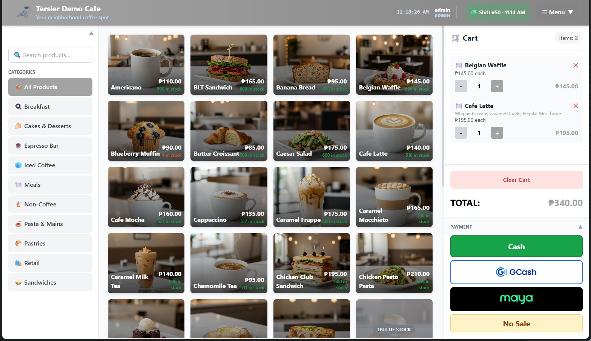
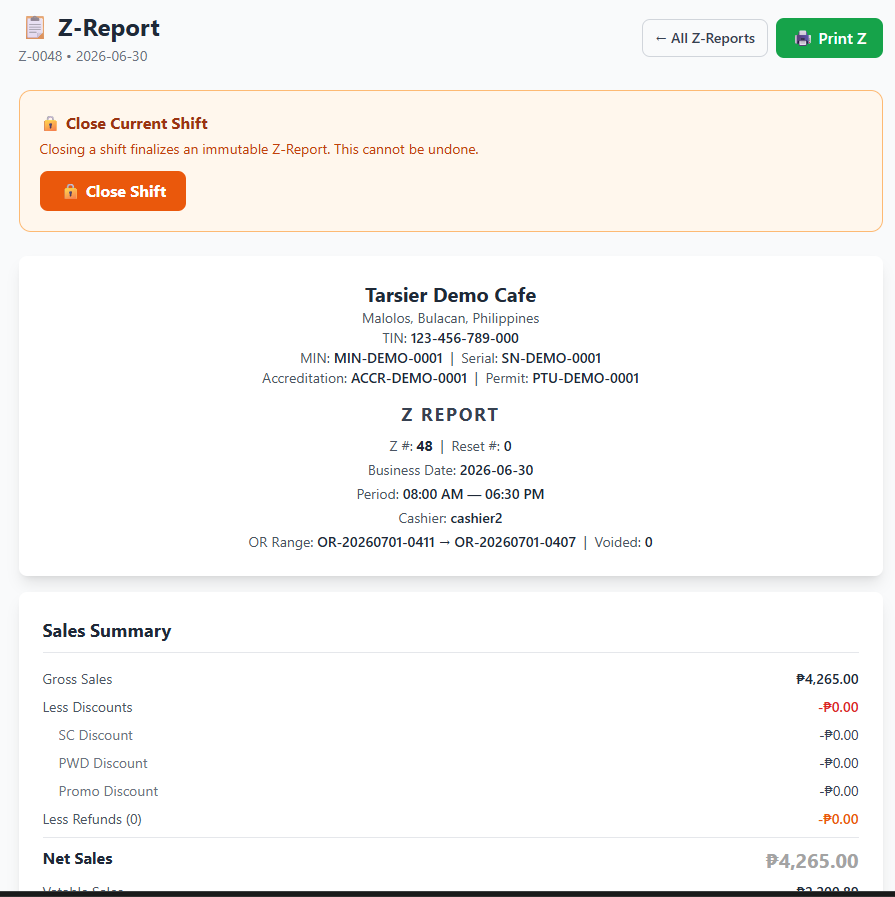
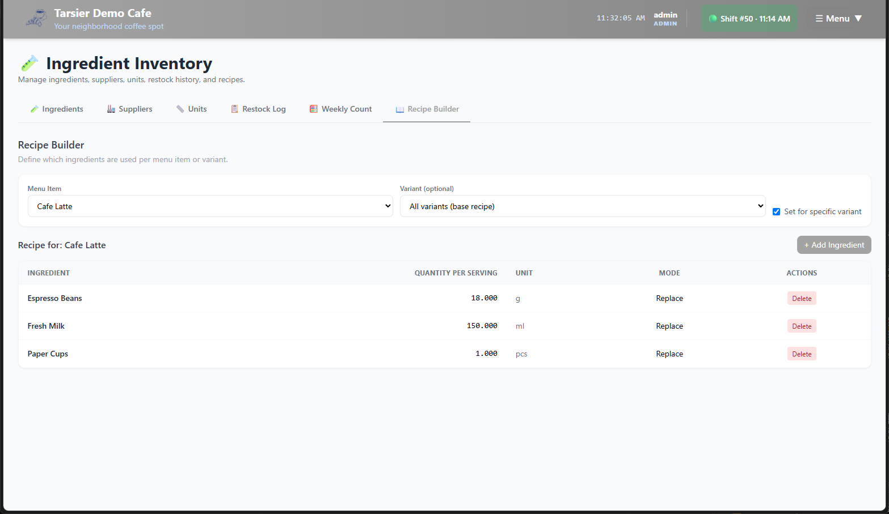

# ProjectPOS

An offline-first point-of-sale system for small cafés and restaurants. Django + DRF
on the back, a vanilla-JS progressive web app on the front, SQLite underneath — built
to keep taking orders when the internet drops, which in Baguio it does.

**This is production software.** It runs a café's register daily: real orders, real
receipts, real inventory, real end-of-day reconciliation.



<sub>Screenshots are from the demo instance. No client data appears anywhere in this repository.</sub>

---

## Why it looks like this

The constraints came from the shop floor, not from a framework tutorial.

**Offline-first, not offline-tolerant.** The till cannot stop because an ISP did.
The frontend is a service-worker-backed PWA over a local server; the register keeps
selling through an outage and reconciles afterwards.

**No build step on the frontend.** Thirteen hand-written pages, plain JavaScript, no
bundler and no framework. A POS that a non-developer has to be able to recover at 6 am
should not need `npm install` to boot.

**Single-box deployment.** SQLite, gunicorn and nginx under systemd, with a kiosk
launcher, a health watchdog and rotating local backups. There is no cloud in the
critical path because the shop's uptime should not depend on one.

**Money is never a float.** `django-money` throughout. Stored payment-gateway
credentials are encrypted at rest with Fernet (`pos.fields.FernetEncryptedField`).

---

## What it does

| Area | Detail |
|---|---|
| **Sales** | Order entry, split/partial payment, pluggable payment adapters, void and refund paths |
| **Receipts** | Thermal-printer layout engine with a configurable template; local-time correctness is enforced by tests |
| **Inventory** | Metered vs. counted stock, purchase-unit restocking, weighted-average cost, weekly counts |
| **Recipes** | Per-serving ingredient breakdown with derived COGS and variant isolation |
| **Reporting** | Z-report, period reports, COGS reporting, end-of-day reconciliation |
| **Access** | JWT auth with role-based permissions and per-scope serializers |
| **Ops** | systemd units, kiosk mode, network watchdog, TLS cert renewal, backup rotation |

### End of day, and where the cost comes from

| | |
|---|---|
|  |  |
| **Z-report.** An immutable end-of-shift close with the BIR fields a Philippine register is required to print — MIN, serial, accreditation and permit numbers, and SC/PWD discount lines broken out separately. | **Recipe builder.** Ingredients per serving, per menu item and per variant. This is what makes COGS derivable rather than guessed, and it is where the per-serving vs. per-batch bug came from. |

---

## Testing

**668 tests across 77 files — roughly one line of test for every three lines of
application code.**

```bash
python manage.py test
```

The suite is regression-led: tests are named for the defect they pin down
(`test_receipt_localtime_issue123`, `test_recipe_variant_isolation`,
`test_metered_vs_counted`). Several encode findings from the shop floor — a recipe
entered per-serving instead of per-batch, a receipt printing eight hours behind —
so the bug that cost a real day's reconciliation cannot come back silently.

There are no `TODO`, `FIXME` or `HACK` markers anywhere in the codebase.

---

## Layout

```
pos/                Django app — models, services, serializers, views, payment adapters
pos_config/         settings, middleware, URLs, ASGI/WSGI
frontend/public/    PWA — 13 pages, service worker, manifest, no build step
scripts/            deploy, kiosk, network watchdog, TLS, systemd units
config/             nginx + systemd templates
docs/               architecture notes, ops runbook, audit findings
```

54 migrations. Django 5.2, DRF 3.15, SimpleJWT, django-money, cryptography.

## Running it

```bash
cp .env.example .env          # then fill DJANGO_SECRET_KEY and FERNET_KEY
pip install -r requirements.txt
python manage.py migrate
python manage.py runserver
```

`DJANGO_SECRET_KEY` and `FERNET_KEY` have no fallbacks — the app refuses to start
without them, by design. Full deployment is documented in [`docs/OPS.md`](docs/OPS.md).

---

## Notes for readers

Hostnames, IP addresses and business names in this repository are placeholders. The
system is deployed to a single client register; nothing identifying that deployment is
published here, and no customer data has ever been committed.

`pos/views.py` is 3,298 lines and wants decomposing into per-domain viewsets. It is
honest debt from shipping against a real opening date, and it is next.

## License

See [LICENSE](LICENSE).
